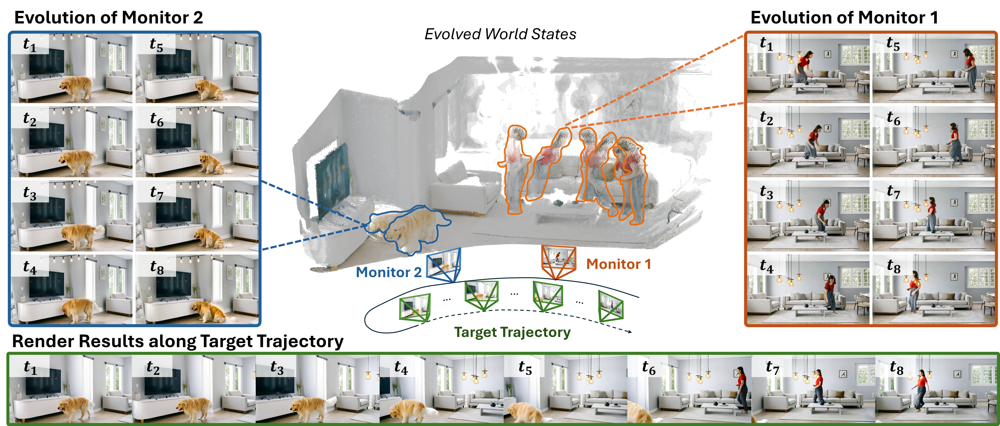

<div align="center">

<h1>🌏 LiveWorld: Simulating Out-of-Sight Dynamics in Generative Video World Models</h1>

<div>
    <a href='https://zichengduan.github.io' target='_blank'>Zicheng Duan<sup>1*</sup></a>&emsp;
    <a href='https://jiatongxia.github.io' target='_blank'>Jiatong Xia<sup>1*</sup></a>&emsp;
    <a href='https://steve-zeyu-zhang.github.io' target='_blank'>Zeyu Zhang<sup>2*</sup></a>&emsp;
    <a href='https://zwbx.github.io' target='_blank'>Wenbo Zhang<sup>1</sup></a>&emsp;
    <a href='https://gengzezhou.github.io' target='_blank'>Gengze Zhou<sup>1</sup></a>&emsp;
    <br>
    <a href='https://scholar.google.com/citations?user=tlhShPsAAAAJ' target='_blank'>Chenhui Gou<sup>3</sup></a>&emsp;
    <a href='https://scholar.google.com/citations?user=CTEQwwwAAAAJ' target='_blank'>Yefei He<sup>4</sup></a>&emsp;
    <a href='https://scholar.google.com/citations?user=fwpY_HoAAAAJ' target='_blank'>Feng Chen<sup>1†</sup></a>&emsp;
    <a href='https://zhangxinyu-xyz.github.io' target='_blank'>Xinyu Zhang<sup>5‡</sup></a>&emsp;
    <a href='https://researchers.adelaide.edu.au/profile/lingqiao.liu' target='_blank'>Lingqiao Liu<sup>1†‡</sup></a>
</div>

<sup>1</sup>Adelaide University&emsp;
<sup>2</sup>The Australian National University&emsp;
<sup>3</sup>Monash University&emsp;
<sup>4</sup>Zhejiang University&emsp;
<sup>5</sup>University of Auckland

<sub>* Equal contribution&emsp;† Project lead&emsp;‡ Corresponding author</sub>

<div>
    <a href='https://zichengduan.github.io/LiveWorld' target='_blank'></a>
    <a href='https://arxiv.org/abs/xxxx.xxxxx' target='_blank'></a>
    <a href='https://huggingface.co/ZichengD/LiveWorld' target='_blank'></a>
</div>

<br>

</div>



*LiveWorld enables persistent out-of-sight dynamics. Instead of freezing unobserved regions, our framework explicitly decouples world evolution from observation rendering. We register stationary Monitors to autonomously fast-forward the temporal progression of active entities in the background. As the observer explores the scene along the target trajectory, our state-aware renderer projects the continuously evolved world states to synthesize the final observation, ensuring that dynamic events progress naturally even when entities are completely out of the observer's view.*

## 📋 TODOs

- [x] Inference code and pretrained weights (initial version in the paper)
- [x] Training code
- [x] Training data preparation pipeline
- [x] Inference sample preparation pipeline
- [x] Demo data and examples (inference + training)
- [ ] LiveBench and its inference scripts
- [ ] Model trained on 1.3B backbone
- [ ] Model (14B/1.3B) with better training

## 🔧 Installation

**Tested environment:**
- Ubuntu 22.04, Python 3.11, CUDA 12.8, PyTorch 2.8 (cu128)
- H100 96GB / H200 140GB, 128GB+ system memory
- Flash Attention 2.8.3 (Flash Attention 3 is also supported on Hopper GPUs but requires [building from source](https://github.com/dao-ailab/flash-attention#flashattention-3-beta-release))

**1. Create conda environment**
```bash
conda create -n liveworld python=3.11 -y
conda activate liveworld
```

**2. Clone the repository and install ffmpeg**
```bash
git clone https://github.com/ZichengDuan/LiveWorld.git
cd LiveWorld

# Install ffmpeg (either way works)
conda install -c conda-forge ffmpeg -y
# or: sudo apt-get update && sudo apt-get install -y ffmpeg
```

**3. Install PyTorch**
```bash
pip install torch==2.8.0 torchvision==0.23.0 torchaudio==2.8.0 --index-url https://download.pytorch.org/whl/cu128
```

**4. Setup environment (install dependencies + download model weights)**
```bash
bash setup_env.sh
```

This script will:
- Install Python dependencies from `setup/requirements.txt`
- Install LiveWorld and local packages (SAM3, Stream3R)
- Download all pretrained weights (~100GB) into `ckpts/`

<details>
<summary>📦 Downloaded model weights</summary>

| Model | Source | Purpose |
|---|---|---|
| LiveWorld State Adapter + LoRA | [ZichengD/LiveWorld](https://huggingface.co/ZichengD/LiveWorld) | Core LiveWorld weights |
| Wan2.1-T2V-14B | [Wan-AI/Wan2.1-T2V-14B](https://huggingface.co/Wan-AI/Wan2.1-T2V-14B) | Backbone |
| Wan2.1-Fun-1.3B-InP | [alibaba-pai/Wan2.1-Fun-1.3B-InP](https://huggingface.co/alibaba-pai/Wan2.1-Fun-1.3B-InP) | VAE (data preparation) |
| Wan2.1-T2V-14B-StepDistill | [lightx2v/Wan2.1-T2V-14B-StepDistill-CfgDistill](https://huggingface.co/lightx2v/Wan2.1-T2V-14B-StepDistill-CfgDistill) | Distilled backbone (optional fast inference) |
| Qwen3-VL-8B-Instruct | [Qwen/Qwen3-VL-8B-Instruct](https://huggingface.co/Qwen/Qwen3-VL-8B-Instruct) | Entity detection |
| SAM3 | [facebook/sam3](https://huggingface.co/facebook/sam3) | Video segmentation |
| STream3R | [yslan/STream3R](https://huggingface.co/yslan/STream3R) | 3D reconstruction |
| DINOv3 | [facebook/dinov3-vith16plus-pretrain-lvd1689m](https://huggingface.co/facebook/dinov3-vith16plus-pretrain-lvd1689m) | Entity matching |

</details>

## 🚀 Inference

### 1. Prepare inference samples from source images

Place source images in `examples/inference_sample/raw/`, then run:
```bash
bash create_infer_sample.sh
```

This generates per-image inference configs under `examples/inference_sample/processed/`, including:
- Scene point cloud (via Stream3R)
- Camera trajectories
- Entity detection and storyline (via Qwen3-VL)

> A pre-built sample (`kid_coffee`) is already included under `examples/inference_sample/processed/` — you can skip this step and go directly to inference.

### 2. Run inference

Edit `infer.sh` to set your config path and GPU, then run:
```bash
bash infer.sh
```

Example `infer.sh`:
```bash
export CUDA_VISIBLE_DEVICES=0
python scripts/infer.py \
    --config examples/inference_sample/processed/kid_coffee/infer_scripts/case1_right.yaml \
    --system-config configs/infer_system_config_few_step_14B.yaml \
    --output-root outputs \
    --device cuda:0
```

Two system configs are provided:
- `configs/infer_system_config_14B.yaml` — full-step inference
- `configs/infer_system_config_few_step_14B.yaml` — 4-step distilled inference (faster)

## 🏋️ Training

### 1. Prepare training data

Place source videos in `examples/training_sample/raw/` (organized by dataset name), then run:
```bash
bash create_train_sample.sh
```

This runs a 4-step pipeline:
1. **Build samples** — clip extraction, entity detection (Qwen3-VL), segmentation (SAM3), geometry estimation (Stream3R), sample construction
2. **Captioning** — generate text descriptions with Qwen3-VL
3. **VAE encode** — encode videos to latent space
4. **Pack LMDB** — package into sharded LMDB for training

Example training samples from MIRA, RealEstate10K, and SpatiaVID_HQ are included under `examples/training_sample/`.

### 2. Run training

Edit `train.sh` to set your GPU configuration, then run:
```bash
bash train.sh
```

Training configs:
- `configs/train_liveworld_14B.yaml` — 14B backbone
- `configs/train_liveworld_1-3B.yaml` — 1.3B backbone

Both `train.sh` and `create_train_sample.sh` support multi-node multi-GPU — edit the `NODES` and `CUDA_VISIBLE_DEVICES_LIST` arrays at the top of each script.

## 📁 Project Structure

```
LiveWorld/
├── infer.sh                        # Inference entry point
├── train.sh                        # Training entry point
├── create_infer_sample.sh          # Inference sample preparation
├── create_train_sample.sh          # Training data preparation
├── setup_env.sh                    # One-click environment setup
├── setup/                          # Installation scripts & requirements
├── configs/
│   ├── infer_system_config_14B.yaml        # Full-step inference config
│   ├── infer_system_config_few_step_14B.yaml  # 4-step distilled inference config
│   ├── train_liveworld_14B.yaml            # 14B training config
│   ├── train_liveworld_1-3B.yaml           # 1.3B training config
│   └── data_preparation.yaml               # Data preparation config
├── liveworld/                      # Core package
│   ├── trainer.py                  # Task definition + training loop
│   ├── wrapper.py                  # Model wrappers (VAE, text encoder, State Adapter)
│   ├── dataset.py                  # LMDB dataset loader
│   ├── utils.py                    # Utilities
│   ├── geometry_utils.py           # Geometry & projection utilities
│   └── pipelines/
│       ├── pipeline_unified_backbone.py    # Unified Backbone
│       ├── pointcloud_updater.py           # Stream3R point cloud handler
│       └── monitor_centric/                # Monitor-Centric Evolution Pipeline
├── scripts/
│   ├── infer.py                    # Inference script
│   ├── train.py                    # Training script
│   ├── create_infer_sample/        # Inference sample creation
│   │   ├── assemble_event_bench.py     # Main assembly (trajectory + storyline)
│   │   ├── build_scene_pointcloud.py   # Scene 3D reconstruction
│   │   └── plot_trajectories_3d.py     # Trajectory visualization
│   ├── create_train_data/          # Training data processing steps
│   │   ├── step1_build_samples.py      # Clip extraction + geometry + samples
│   │   ├── step2_captioning.py         # Video captioning
│   │   ├── step3_vae_encode.py         # VAE encoding
│   │   ├── step4a_pack_lmdb.py         # LMDB packing
│   │   └── step4b_cache_keys.py        # Key caching
│   └── dataset_preparation/        # Legacy data preparation
├── examples/
│   ├── inference_sample/           # Inference example
│   │   ├── raw/                        # Source images (input)
│   │   └── processed/                  # Generated configs + point clouds (output)
│   └── training_sample/            # Training example
│       ├── raw/                        # Source videos (input)
│       ├── processed/                  # Extracted samples (intermediate)
│       └── processed_lmdb/             # Packed LMDB (output)
├── misc/
│   ├── sam3/                       # SAM3 (local package)
│   └── STream3R/                   # Stream3R (local package)
└── ckpts/                          # Model weights (downloaded by setup_env.sh)
```

## ❓ FAQ

<details>
<summary>How to summon foreground entities into the scene?</summary>

By default, the system only generates `scene_text` (background description) and does not automatically produce `fg_text`. To introduce foreground entities (e.g., a person, animal, or object), manually add a `fg_text` field to the corresponding iteration in your inference YAML config:

```yaml
iter_input:
  '0':
    scene_text: The brick wall backdrop remains visible behind the stall...
    fg_text: 'On the right, a wooden bench under the wall sits a lovely corgi dog, staying steadily on the bench and rest.'
```

The `fg_text` describes the foreground entity you want to appear and its behavior. You can edit this in any generated config under `examples/inference_sample/processed/<image>/infer_scripts/*.yaml`.

</details>

## 📝 Citation

If you find this work helpful, please consider citing:

```bibtex
@article{duan2026liveworld,
  title={LiveWorld: Simulating Out-of-Sight Dynamics in Generative Video World Models},
  author={Duan, Zicheng and Xia, Jiatong and Zhang, Zeyu and Zhang, Wenbo and Zhou, Gengze and Gou, Chenhui and He, Yefei and Chen, Feng and Zhang, Xinyu and Liu, Lingqiao},
  journal={arXiv preprint arXiv:2603.07145},
  year={2026}
}
```

## 📄 License

TBD
